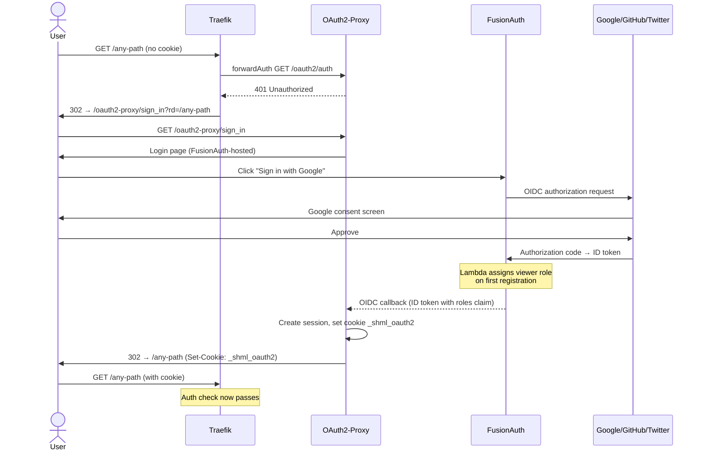
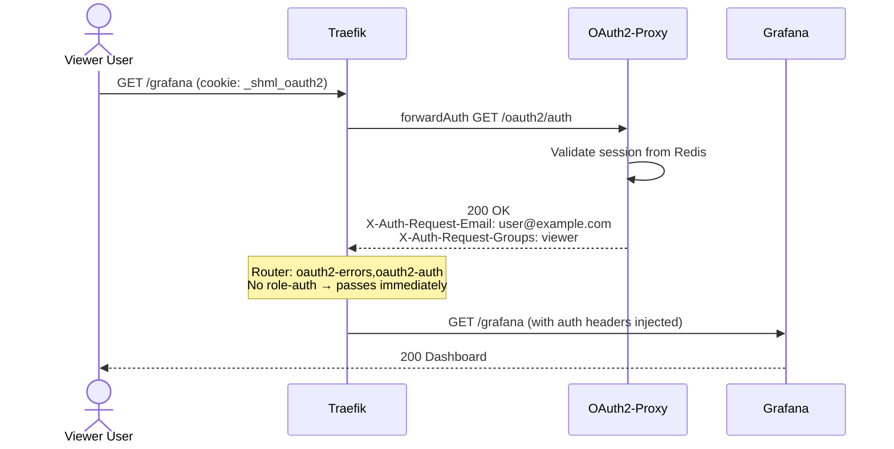
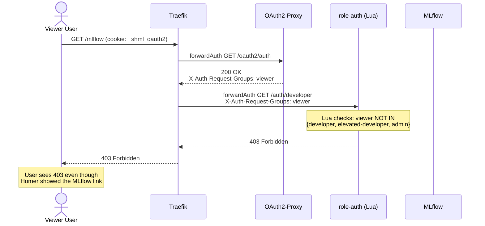
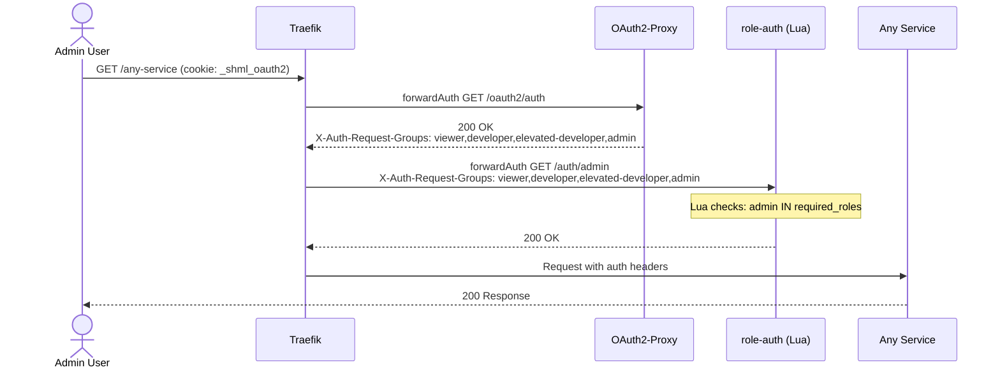

# Platform Architecture

**Last Updated:** 2025-01-09
**Version:** 0.2.x
**Audit Status:** Auth stack fully audited (W1 complete)

---

## Table of Contents

1. [Auth & Access Control Architecture](#auth--access-control-architecture)
   - [Stack Components](#stack-components)
   - [Authentication Flows](#authentication-flows)
   - [Service Access Matrix](#service-access-matrix)
   - [Middleware Chain Reference](#middleware-chain-reference)
   - [UX Gaps & Fixes](#ux-gaps--fixes)
2. [Infrastructure Overview](#infrastructure-overview)
3. [Data Architecture](#data-architecture)

---

## Auth & Access Control Architecture

### Stack Components

```
Browser → Traefik (reverse proxy)
                ↓ forwardAuth (per-router)
           OAuth2-Proxy  ←→  Redis (sessions)
                ↓ OIDC
           FusionAuth    ←→  PostgreSQL (users/roles)
                ↑ identity providers
           Google / GitHub / Twitter (OAuth2)
                ↓ (if role check required)
           role-auth (nginx + Lua RBAC)
```

| Component | Container | Port | Purpose |
|-----------|-----------|------|---------|
| Traefik | `shml-traefik` | :80, :443 | Reverse proxy, TLS, forwardAuth middleware |
| OAuth2-Proxy | `shml-oauth2-proxy` | :4180 | Session management, OIDC token validation |
| FusionAuth | `shml-fusionauth` | :9011 (localhost-only) | Identity provider, OIDC issuer, user management |
| role-auth | `shml-role-auth` | :8080 | Lua RBAC – checks `X-Auth-Request-Groups` header |
| Redis | `shml-redis` | :6379 | OAuth2-Proxy session store |
| PostgreSQL | `shml-postgres` | :5432 | FusionAuth user/role data |

**Roles (least to most privileged):**
```
viewer < developer < elevated-developer < admin
```

**Cookie:** `_shml_oauth2` (8h expiry, Redis-backed session)

---

### Authentication Flows

#### Flow 1: Unauthenticated User



#### Flow 2: Viewer User — Accessing Allowed Service (Grafana)



#### Flow 3: Viewer User — Accessing Restricted Service (MLflow/Ray)



#### Flow 4: Admin User — Full Access



---

### Service Access Matrix

**Enforcement:** `oauth2-auth` = any authenticated user | `role-auth-*` = role required by Traefik forwardAuth

| Service | Path | Traefik Middleware Chain | Min. Role | Homer Tag | UX Gap? |
|---------|------|--------------------------|-----------|-----------|---------|
| Homer Dashboard | `/` | `oauth2-auth` | Authenticated | — | — |
| **AI Chat** | `/chat-ui/` | `oauth2-auth, role-auth-developer` | developer | **none** | ⚠️ YES |
| VS Code IDE | `/ide/` | `oauth2-auth, role-auth-admin` | admin | admin | ✓ |
| Obsidian Vault | `obsidian://` | Local app | local | developer | ✓ |
| SBA Resource Portal | `/sba-portal/` | `oauth2-auth, role-auth-developer` | developer | developer | ✓ |
| **MLflow** | `/mlflow/` | `oauth2-auth, role-auth-developer` | developer | **none** | ⚠️ YES |
| **MLflow API** | `/api/2.0/mlflow` | `oauth2-auth, role-auth-developer` | developer | — | — |
| **Ray Dashboard** | `/ray/` | `oauth2-auth, role-auth-developer` | developer | **none** | ⚠️ YES |
| Ray API | `/api/ray/` | `oauth2-auth, role-auth-developer` | developer | — | — |
| Ray UI | `/ray/ui/` | `oauth2-auth, role-auth-developer` | developer | — | — |
| Nessie | `/nessie/` | `oauth2-auth, role-auth-developer` | developer | developer | ✓ |
| FiftyOne | `/fiftyone/` | `oauth2-auth, role-auth-developer` | developer | developer | ✓ |
| GitLab | `/gitlab/` | `oauth2-auth, role-auth-developer` | developer | developer | ✓ |
| Grafana | `/grafana/` | `oauth2-auth` | Authenticated | none | ✓ |
| Feature SLOs | `/grafana/d/...` | `oauth2-auth` | Authenticated | none | ✓ |
| **Prometheus** | `/prometheus/` | `oauth2-auth, role-auth-admin` | admin | **none** | ⚠️ YES |
| **Traefik Dashboard** | `/traefik/` | `oauth2-auth, role-auth-admin` | admin | **none** | ⚠️ YES |
| Watchdog | `/watchdog/` | `oauth2-auth, role-auth-admin` | admin | admin | ✓ |
| Infisical | `/secrets/` | `oauth2-auth, role-auth-admin` | admin | admin | ✓ |
| FusionAuth | `/auth/` | `fusionauth-headers` only | **Public** | none | ✓ |
| FusionAuth Admin | `/admin/` | `oauth2-auth, role-auth-admin` | admin | admin | ✓ |

---

### Middleware Chain Reference

```
Defined in:  deploy/compose/docker-compose.auth.yml
             deploy/compose/docker-compose.infra.yml
```

#### Defined Middlewares

| Middleware Name | Type | Target | Purpose |
|----------------|------|--------|---------|
| `oauth2-errors` | errors | 401 → redirect | Redirect unauthenticated requests to sign-in page |
| `oauth2-auth` | forwardAuth | OAuth2-Proxy `/oauth2/auth` | Session validation, inject auth headers |
| `role-auth-developer` | forwardAuth | role-auth `/auth/developer` | Allow developer, elevated-developer, admin |
| `role-auth-elevated` | forwardAuth | role-auth `/auth/elevated-developer` | Allow elevated-developer, admin only |
| `role-auth-admin` | forwardAuth | role-auth `/auth/admin` | Allow admin only |
| `fusionauth-headers` | headers | — | Add required Traefik headers for FusionAuth |
| `fusionauth-rewrite` | replacePathRegex | `/auth(.*)` → `$1` | Strip `/auth` prefix for FusionAuth upstream |

#### Role-Auth Lua Logic (scripts/role-auth/nginx.conf)

```
/auth/viewer     → required: viewer, developer, elevated-developer, admin
/auth/developer  → required: developer, elevated-developer, admin
/auth/elevated-developer → required: elevated-developer, admin
/auth/admin      → required: admin
```

Input: `X-Auth-Request-Groups` header (pipe or comma-separated role list)
Output: `200 OK` (pass) or `403 Forbidden` (block)

#### OAuth2-Proxy Header Passthrough

After successful auth, OAuth2-Proxy injects these headers into upstream requests:
```
X-Auth-Request-Email:  user@example.com
X-Auth-Request-User:   username
X-Auth-Request-Groups: viewer,developer        ← populated from FusionAuth roles claim
```

Configured via: `OAUTH2_PROXY_OIDC_GROUPS_CLAIM=roles` in docker-compose.auth.yml

---

### UX Gaps & Fixes

**Problem:** Homer shows service links to ALL authenticated users, but Traefik blocks access based on role. Viewers see 5 service links that will always return a 403.

#### Gap Summary

| Homer Item | Shown To | Actually Accessible By | Fix |
|------------|----------|----------------------|-----|
| AI Chat (`/chat-ui/`) | Everyone | developer+ | Add `tag: "developer"` |
| MLflow (`/mlflow/`) | Everyone | developer+ | Add `tag: "developer"` |
| Ray Dashboard (`/ray/`) | Everyone | developer+ | Add `tag: "developer"` |
| Prometheus (`/prometheus/`) | Everyone | admin only | Add `tag: "admin"` |
| Traefik Dashboard (`/traefik/`) | Everyone | admin only | Add `tag: "admin"` |

> **Note:** Homer's `tag` field is a UI organization/filter tool, not a security control.
> Tags help users self-identify which services apply to their role, but Traefik enforces
> the actual access control regardless of what Homer displays.

#### Required Homer Config Changes

File: `monitoring/homer/config.yml`

```yaml
# AI Chat — change from no tag to:
  - name: "AI Chat"
    tag: "developer"   # ADD THIS

# MLflow — change from no tag to:
  - name: "MLflow"
    tag: "developer"   # ADD THIS

# Ray Dashboard — change from no tag to:
  - name: "Ray Dashboard"
    tag: "developer"   # ADD THIS

# Prometheus — change from no tag to:
  - name: "Prometheus"
    tag: "admin"       # ADD THIS

# Traefik Dashboard — change from no tag to:
  - name: "Traefik Dashboard"
    tag: "admin"       # ADD THIS
```

#### Lambda App ID Discrepancy

**Issue:** `fusionauth/lambdas/google-registration-default-role.js` references OAuth2-Proxy application ID
`acda34f0-7cf2-40eb-9cba-7cb0048857d3`, but `fusionauth/kickstart/kickstart.json` defines the OAuth2-Proxy
app with ID `50a4dc27-578a-47f1-a98e-1b9f47e2e81b`. The live DB shows the active app is
`OAuth2-Proxy-rotation-1` (indicating a key rotation occurred).

**Impact:** The lambda may not assign the default `viewer` role on Google OAuth first login, leaving new
Google accounts with no roles (access blocked at role-auth check).

**Fix:** Update the lambda to use the current application ID from the live FusionAuth database:
```bash
# Find current OAuth2-Proxy app ID:
docker exec shml-postgres psql -U postgres -d fusionauth -t \
  -c "SELECT id, name FROM applications WHERE name LIKE 'OAuth2-Proxy%';"
# Update fusionauth/lambdas/google-registration-default-role.js with the correct ID
```

#### Current Users (Audit Snapshot — 2025-01-09)

| Email | OAuth2-Proxy Roles | Notes |
|-------|-------------------|-------|
| `admin@ml-platform.local` | (not registered in OAuth2-Proxy app) | FusionAuth admin only |
| `axelofwar.web3@gmail.com` | admin, elevated-developer, developer, viewer | Owner account, all roles |

**No pure viewer users exist yet** — kickstart auto-assigns viewer to new Google/GitHub registrations.

---

## Infrastructure Overview

### Service Topology

**Auth Stack (5 services):** FusionAuth, OAuth2-Proxy, role-auth, Redis, PostgreSQL

**MLflow Stack:** mlflow-server, mlflow-api, postgres, redis, nginx, prometheus, grafana, backup

**Ray Compute Stack:** ray-compute-api, ray-compute-ui, ray-head, ray-worker(s), ray-grafana, ray-prometheus

**Traefik Gateway:** traefik (reverse proxy, TLS termination)

**Monitoring:** Grafana, Prometheus, Loki, Promtail, Tempo, Alertmanager, DCGM exporter

**Developer Tools:** VS Code Server, Obsidian, GitLab, FiftyOne, Nessie, Infisical

**Inference Stack:** Qwen3-VL API (RTX 2070), Z-Image API (RTX 3090, on-demand), inference-gateway, inference-postgres

### Network Architecture

```
platform network (external-facing services)
core network (internal service communication)

Browser → Traefik [:80/:443]
  ├─ /auth/*         → FusionAuth [:9011]      (public, no auth required)
  ├─ /oauth2-proxy/* → OAuth2-Proxy [:4180]    (public, login flows)
  ├─ /               → Homer [:8080]            (any authenticated)
  ├─ /grafana/       → Grafana [:3000]          (any authenticated)
  ├─ /chat-ui/       → Chat UI [:3001]          (developer+)
  ├─ /mlflow/        → MLflow [:5000]           (developer+)
  ├─ /ray/           → Ray Dashboard [:8265]    (developer+)
  ├─ /nessie/        → Nessie [:19120]          (developer+)
  ├─ /fiftyone/      → FiftyOne [:5151]         (developer+)
  ├─ /gitlab/        → GitLab [:8929]           (developer+)
  ├─ /sba-portal/    → SBA Portal [:8080]       (developer+)
  ├─ /prometheus/    → Prometheus [:9090]       (admin)
  ├─ /traefik/       → Traefik API [:8080]      (admin)
  ├─ /watchdog/      → Watchdog [:8888]         (admin)
  ├─ /ide/           → VS Code [:8443]          (admin)
  ├─ /secrets/       → Infisical [:3000]        (admin)
  └─ /admin/         → FusionAuth Admin         (admin)
```

---

## Data Architecture

> This section will be updated as part of W2 (Data Pipeline Consolidation).
> See CHANGELOG.md for planned `data-pipelines/` consolidation work.
