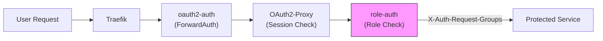

# User Management

Users are managed through FusionAuth, the platform's identity provider.

---

## Access Tiers (RBAC)

The platform enforces 4-tier role-based access control:

| Role | Access Level | Services |
|------|-------------|----------|
| **viewer** | Read-only dashboards | Homer, Grafana |
| **developer** | ML workflows | MLflow, Ray Dashboard, Ray API, Dozzle, Chat API, FiftyOne, Nessie |
| **elevated-developer** | Privileged operations | Agent tools, GitHub actions, model management |
| **admin** | Full platform access | All services + Traefik, Prometheus, Code Server, Infisical |

Roles are hierarchical — an `admin` implicitly has access to everything a `developer` can see.

---

## Creating a User

1. Open FusionAuth Admin UI at `/auth/admin/` (or `localhost:9011/admin/`)
2. Navigate to **Users → Add**
3. Fill in:
    - Email address (required)
    - Password (or send setup email)
    - First / Last name
4. Click **Save**

!!! warning "Registration Required"
    Creating a user account is **not enough**. You must also register the user to the OAuth2-Proxy application and assign a role. Without this, the user can authenticate but will see "Access Denied."

---

## Assigning Roles

1. Open the user's profile in FusionAuth
2. Click the **Registrations** tab
3. Click **Add Registration**
4. Select the **OAuth2-Proxy** application
5. Under **Roles**, check one or more:
    - `viewer`
    - `developer`
    - `elevated-developer`
    - `admin`
6. Click **Save**

The role appears in the `roles` claim of the user's OIDC token and is checked by the `role-auth` middleware on every request.

---

## Role Architecture



1. **OAuth2-Proxy** validates the session cookie or JWT bearer token
2. **OAuth2-Proxy** sets `X-Auth-Request-Groups` header with the user's roles
3. **role-auth** (nginx + lua) checks whether the user has the required role for the target service
4. If the role check passes, the request proceeds to the service

---

## API Keys

For programmatic access (CI/CD, SDK, scripts), use API keys instead of browser sessions.

### Creating an API Key

```bash
# Via CLI
shml keys create --name "ci-pipeline" --role developer

# Via API
curl -X POST https://<domain>/api/ray/keys \
  -H "Authorization: Bearer <admin-jwt>" \
  -d '{"name": "ci-pipeline", "role": "developer"}'
```

### Using an API Key

```bash
# HTTP header
curl -H "X-API-Key: ${SHML_API_KEY}" https://<domain>/api/ray/jobs

# SDK
from shml import Client
client = Client(api_key="YOUR_API_KEY")
```

### Environment-Based Service Account Keys

Pre-configured in `.env` for platform services:

| Variable | Role | Purpose |
|----------|------|---------|
| `CICD_ADMIN_KEY` | admin | Full platform access from CI/CD |
| `CICD_DEVELOPER_KEY` | developer | Standard job submission |
| `CICD_ELEVATED_DEVELOPER_KEY` | elevated-developer | Model management |
| `CICD_VIEWER_KEY` | viewer | Read-only monitoring |

### Key Rotation

```bash
# Rotate a key (24-hour grace period — both keys work)
curl -X POST https://<domain>/api/ray/keys/<key-id>/rotate \
  -H "Authorization: Bearer <admin-jwt>"
```

!!! tip "JWT Bearer Tokens"
    OAuth2-Proxy also supports direct JWT bearer tokens (`Authorization: Bearer <token>`). These are validated against FusionAuth's JWKS endpoint and bypass cookie authentication — useful for server-to-server communication.

---

## Removing Access

1. Open the user's profile in FusionAuth
2. Go to **Registrations** tab
3. Click **Delete** on the OAuth2-Proxy registration

The user will be unable to access any protected service on their next request (existing sessions expire per cookie TTL).
