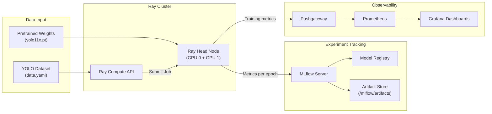
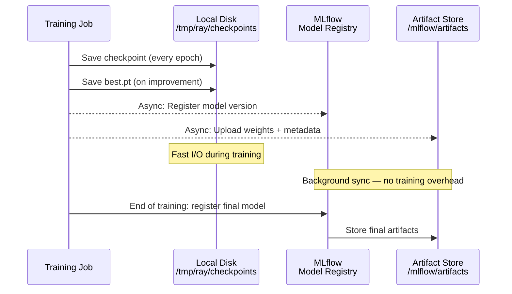
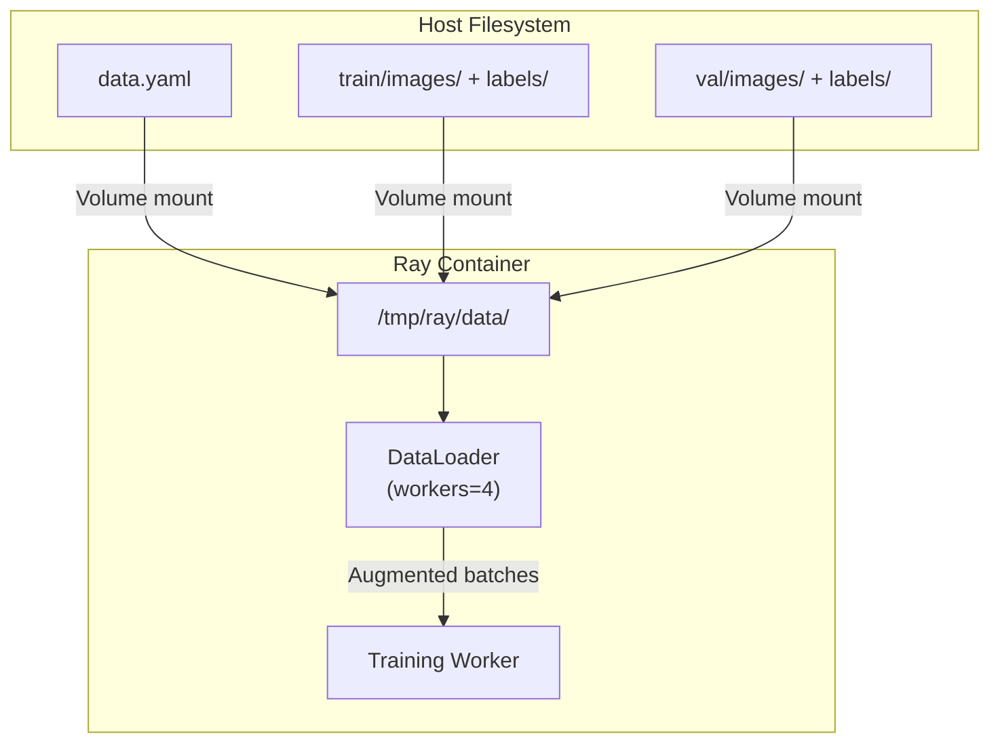
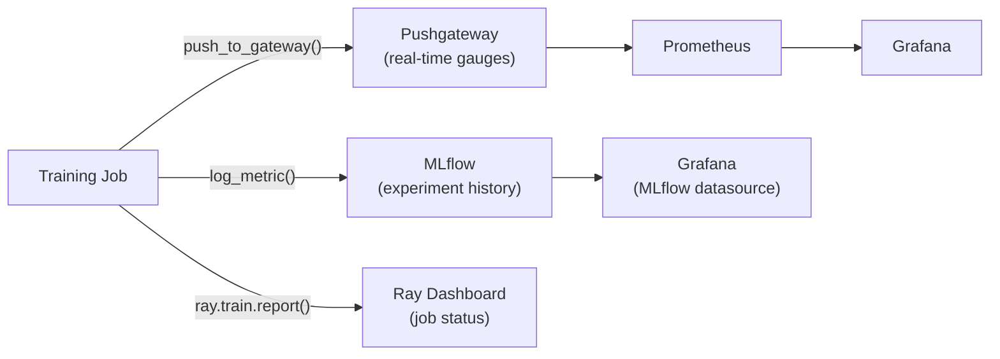
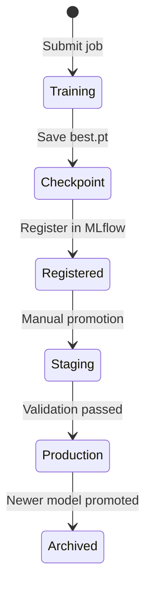

# Data Flow

How data moves through the SHML Platform — from dataset upload to trained model.

---

## End-to-End Training Flow



---

## Checkpoint Flow

Training checkpoints follow a dual-storage strategy: fast local writes during training with asynchronous sync to MLflow.



**Local checkpoint structure:**

```
/tmp/ray/
├── checkpoints/
│   ├── epoch_001/weights/best.pt
│   ├── epoch_002/weights/best.pt
│   └── ...
└── data/
    └── wider_face_yolo/
        ├── data.yaml
        ├── train/images/
        └── val/images/
```

---

## Dataset Flow

YOLO datasets are mounted into the Ray container and referenced by `data.yaml`.



!!! note "Dataset Configuration"
    The `data.yaml` path is set in `TrainingConfig.data_yaml` (default: `/tmp/ray/data/wider_face_yolo/data.yaml`). The SDK and CLI both accept this as a parameter.

---

## Metrics Flow

Training metrics flow to three destinations simultaneously:



| Destination | What it captures | Retention |
|------------|-----------------|-----------|
| MLflow | Epoch-level metrics (loss, mAP50, recall, precision) | Permanent |
| Pushgateway → Prometheus | Real-time training gauges (GPU util, VRAM, cost) | 90 days |
| Ray Dashboard | Job status, logs, runtime metadata | Session |

---

## Model Promotion Flow

After training completes, models move through the registry:



!!! info "Model Naming"
    The default model name in the registry is `face-detection-yolov8l-p2` (set via `MLFLOW_REGISTRY_MODEL_NAME` in `config/platform.env`).

---

## Data Lifecycle

| Data Type | Location | Persistent? | Backed Up? |
|-----------|----------|:-----------:|:----------:|
| Training datasets | `/tmp/ray/data/` (volume) | Yes | No (re-downloadable) |
| Checkpoints (during training) | `/tmp/ray/checkpoints/` | Yes | Via MLflow sync |
| MLflow artifacts | `/mlflow/artifacts/` (bind mount) | Yes | Yes |
| MLflow metadata | PostgreSQL `mlflow_db` | Yes | Yes (every 6h) |
| Prometheus metrics | `global-prometheus-data` volume | Yes | No |
| Grafana dashboards | `unified-grafana-data` volume | Yes | No (provisioned from files) |
