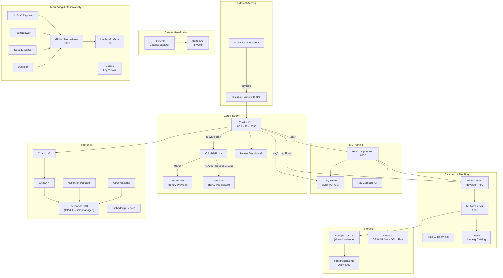
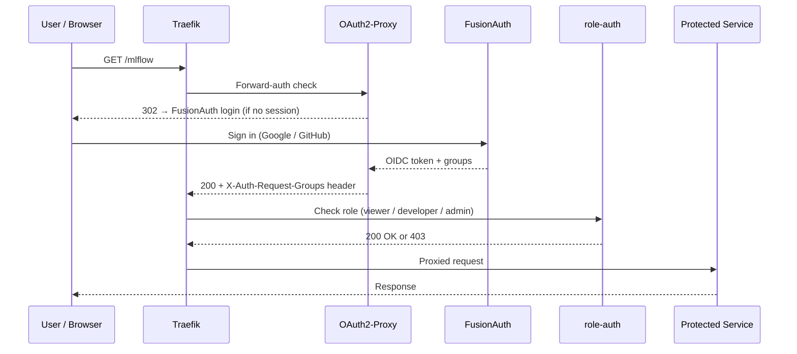

# Architecture Overview

**SHML Platform** — Self-Hosted ML platform for training, inference, and experiment tracking on consumer hardware.

!!! info "Hardware"
    **CPU:** AMD Ryzen 9 3900X (12C/24T) &middot; **GPU 0:** NVIDIA RTX 3090 Ti (24 GB) &middot; **GPU 1:** NVIDIA RTX 2070 (8 GB) &middot; **RAM:** 64 GB DDR4

---

## System Diagram



---

## Docker Compose Organization

The platform is split across multiple compose files, started via `./start_all_safe.sh`:

| Compose File | Services | Purpose |
|---|---|---|
| `docker-compose.infra.yml` | traefik, postgres, redis, fusionauth, oauth2-proxy, role-auth, nessie, global-prometheus, unified-grafana, ml-slo-exporter, pushgateway, node-exporter, cadvisor, dozzle, homer, sba-resource-portal, postgres-backup, webhook-deployer, code-server, fiftyone, fiftyone-mongodb | Shared infrastructure, auth, monitoring, data |
| `mlflow-server/docker-compose.yml` | mlflow-server, mlflow-nginx, mlflow-api, mlflow-prometheus | Experiment tracking |
| `ray_compute/docker-compose.yml` | ray-head, ray-compute-api, ray-compute-ui, ray-prometheus | Compute cluster & job management |
| `inference/nemotron/docker-compose.yml` | nemotron-coding, nemotron-manager | Primary coding model (30B) |
| `inference/chat-api/docker-compose.yml` | chat-api | Chat completion API |
| `inference/embedding-service/docker-compose.yml` | embedding-service | Text embeddings |
| `inference/gpu-manager/docker-compose.yml` | gpu-manager | GPU allocation coordination |
| `chat-ui-v2/docker-compose.yml` | chat-ui | Web chat interface |

!!! tip "Never run `docker compose up` on the root `docker-compose.yml`"
    The root file is intentionally empty (`services: {}`). Always use `./start_all_safe.sh` which orchestrates the individual compose files in dependency order.

---

## Network Architecture

All services share a single Docker bridge network for DNS-based service discovery.

```yaml
networks:
  platform:                    # "shml-platform" at runtime
    driver: bridge
    ipam:
      config:
        - subnet: 172.30.0.0/16
```

### Port Exposure

Only Traefik exposes ports to the host — all other services communicate over the internal Docker network using service names.

| Port | Binding | Service | Purpose |
|------|---------|---------|---------|
| **80** | `127.0.0.1` + `LAN_IP` | Traefik | HTTP entry point |
| **443** | `127.0.0.1` + `LAN_IP` | Traefik | HTTPS (TLS via Tailscale certs) |
| **8090** | `0.0.0.0` | Traefik | Dashboard / API |

### Internal Service Communication

Services reference each other by Docker DNS name — never `localhost`:

```python
# ✅ Correct (container-to-container)
MLFLOW_TRACKING_URI = "http://mlflow-nginx:80"
RAY_ADDRESS         = "http://ray-head:8265"
REDIS_HOST          = "ml-platform-redis"

# ❌ Wrong
MLFLOW_TRACKING_URI = "http://localhost:8080"
```

### Traefik Routing Rules

| Priority | Path | Target | Middleware |
|----------|------|--------|------------|
| 400 | `/api/2.0/mlflow` | mlflow-nginx:80 | strip-prefix |
| 350 | `/ajax-api` | mlflow-nginx:80 | strip-prefix |
| 10 | `/mlflow` | mlflow-nginx:80 | strip-prefix, oauth2-auth |
| — | `/ray/*` | ray-head:8265 | oauth2-auth, role-auth-developer |
| — | `/api/*` | ray-compute-api:8000 | oauth2-auth, role-auth-developer |
| — | `/traefik` | traefik:8080 | oauth2-auth, role-auth-admin |

---

## Security Model

### Authentication Flow



### Role-Based Access Control

| Role | Default | Accessible Services |
|------|---------|---------------------|
| **viewer** | Yes (auto on signup) | Homer dashboard, Grafana |
| **developer** | Admin-granted | + MLflow, Ray Dashboard/API, Dozzle, Code Server |
| **admin** | Admin-granted | + Traefik dashboard, Prometheus, system admin |

Identity providers (Google, GitHub) auto-register users with the `viewer` role. Admins promote users via the FusionAuth Admin UI.

### Secrets

Secrets are stored as files on disk (not in environment variables or version control) and mounted via Docker secrets:

```yaml
secrets:
  mlflow_db_password:
    file: ./secrets/db_password.txt

services:
  mlflow-server:
    secrets:
      - mlflow_db_password
    environment:
      POSTGRES_PASSWORD_FILE: /run/secrets/mlflow_db_password
```

---

## GPU Allocation

The platform uses **dedicated GPU assignment** — not MPS — because large models exceed the memory budget for sharing.

| GPU | Device | VRAM | Assignment |
|-----|--------|------|------------|
| **GPU 0** | RTX 3090 Ti | 24 GB | Training **or** primary inference (mutually exclusive) |
| **GPU 1** | RTX 2070 | 8 GB | Fallback inference model (always available) |

### Idle Management

The primary model (Nemotron 30B on GPU 0) implements idle-sleep after 30 minutes of inactivity:

| State | Health Check | Traefik Routing | GPU Memory |
|-------|-------------|-----------------|------------|
| **Active** | healthy | Primary (priority 210) | ~22 GB |
| **Sleeping** | unhealthy | Fallback (priority 200) | ~0 GB (freed) |
| **Yielded** (training) | unhealthy | Fallback | ~0 GB (freed) |
| **Waking** | unhealthy | Fallback | Loading… |

Traefik health checks automatically route traffic to the fallback model on GPU 1 when the primary is sleeping or yielded for training.

---

## Storage

### PostgreSQL 15 (Shared Instance)

A single Postgres instance hosts multiple logical databases with shared connection patterns:

| Database | Used By |
|----------|---------|
| `mlflow` | MLflow metadata, experiments, runs |
| `ray_compute` | Ray job metadata |
| `fusionauth` | Identity / user data |

Automated backups run daily at 2 AM with 90-day retention.

### Redis 7 (Shared Instance, DB Isolation)

```
DB 0 → MLflow (caching)
DB 1 → Ray    (job queue, state)
```

### Volumes

| Type | Examples | Rationale |
|------|----------|-----------|
| **Named volumes** | `mlflow-artifacts`, `ray-data`, `redis-data` | Performance, managed backups |
| **Bind mounts** | `./logs/traefik`, `./ray_compute/data` | Direct host access, easy inspection |

---

## Experiment Tracking & Data Pipeline

### Dual Storage Strategy

Checkpoints are saved to **local disk** (fast I/O) and synced to **MLflow** (versioned, searchable) in the background:

```
Training Loop
  → save to /ray_compute/models/checkpoints/ (instant)
  → async queue → MLflow artifact store (background)
```

### Iceberg / Nessie

Nessie provides Git-like version control for Apache Iceberg tables, enabling reproducible dataset snapshots alongside MLflow experiment runs.

---

## SDK Quick Start

```python
from shml import Client

client = Client()                       # auto-discovers platform via env / DNS
run = client.create_run("my-experiment")
run.log_params({"lr": 0.01, "epochs": 50})
run.log_metrics({"loss": 0.42}, step=1)
```

---

## Startup Sequence

Services are brought up in dependency order by `start_all_safe.sh`:

```
1. Network       → shml-platform bridge
2. Infrastructure → traefik, redis              (parallel)
3. Databases      → postgres                    (wait healthy)
4. Auth           → fusionauth, oauth2-proxy    (wait healthy)
5. Core           → mlflow-server, ray-head     (wait healthy)
6. Frontends      → mlflow-nginx, ray-compute-api, chat-ui
7. Inference      → nemotron, chat-api, embedding-service
8. Monitoring     → prometheus, grafana, dozzle (parallel)
9. Utilities      → homer, code-server, postgres-backup
```

---

## Scaling Path

| Scale | Users | Infra | Key Changes |
|-------|-------|-------|-------------|
| **Current** | < 10 | Single host, 2 GPUs | Docker Compose, local storage |
| **Team** | 10–50 | Multi-host | PG replication, S3 artifacts, Redis Sentinel |
| **Enterprise** | 100+ | Kubernetes | Helm charts, Istio service mesh, managed DBs, multi-region |

!!! note "Current limitations"
    Single point of failure, vertical scaling only, no geo-distribution. For HA, the first step is PostgreSQL replication and an object-store artifact backend.
