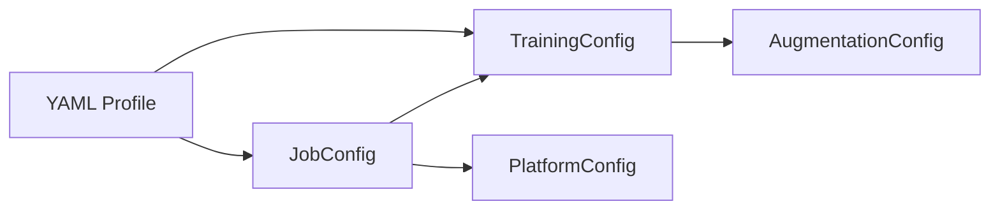

# Training Profiles

Training profiles are YAML files that bundle hyperparameters, augmentation settings, integration toggles, and resource hints into reusable presets.

## Built-in Profiles

| Profile | Epochs | Batch | ImgSz | LR₀ | Patience | Augmentation | Est. Duration |
|---------|--------|-------|-------|-----|----------|--------------|---------------|
| `quick-test` | 2 | 8 | 640 | 0.001 | 5 | Light | ~15 min |
| `balanced` | 10 | 4 | 1280 | 0.0005 | 10 | Moderate | ~2.5 hours |
| `full-finetune` | 50 | 4 | 1280 | 0.0003 | 15 | Aggressive | ~12 hours |
| `foundation` | 100 | 4 | 1280 | 0.0001 | 25 | Comprehensive | ~24+ hours |

!!! tip "Estimated durations assume RTX 3090 Ti with WIDER FACE dataset."

## Usage

=== "CLI"

    ```bash
    shml train --profile balanced
    shml train --profile balanced --epochs 20
    shml train --profile quick-test --batch-size 16
    ```

=== "Python SDK"

    ```python
    from shml import Client

    with Client() as c:
        job = c.submit_training("balanced", epochs=20)
    ```

=== "TrainingConfig"

    ```python
    from shml.config import TrainingConfig

    cfg = TrainingConfig.from_yaml("config/profiles/balanced.yaml")
    cfg = TrainingConfig.from_yaml("config/profiles/balanced.yaml", epochs=20)
    ```

=== "JobConfig"

    ```python
    from shml.config import JobConfig

    job = JobConfig.from_profile("balanced", epochs=20)
    print(job.training.epochs)  # 20
    ```

---

## YAML Format Reference

Profiles are stored in `config/profiles/` as YAML files. Here is the full schema:

```yaml
# Model
model: yolo11x.pt
data_yaml: wider_face_yolo/data.yaml

# Core hyperparameters
epochs: 10
batch_size: 4          # alias for "batch"
imgsz: 1280
patience: 10
optimizer: AdamW

# Learning rate
lr0: 0.0005
lrf: 0.01
weight_decay: 0.001
warmup_epochs: 2.0

# Integrations — which platform features to wire up
integrations:
  - mlflow
  - nessie
  - fiftyone
  - features
  - prometheus

mlflow_experiment: balanced-training
nessie_branch_prefix: experiment

# Augmentation — nested block
augmentation:
  hsv_h: 0.015
  hsv_s: 0.5
  hsv_v: 0.3
  degrees: 5.0
  translate: 0.1
  scale: 0.4
  flipud: 0.0
  fliplr: 0.5
  mosaic: 0.8
  mixup: 0.1
  copy_paste: 0.05
  erasing: 0.2
  crop_fraction: 1.0

# GPU management
gpu_yield: true
```

!!! note "Field Aliases"
    `batch_size` is automatically mapped to the `batch` field in `TrainingConfig`.
    Both names are accepted in YAML profiles.

---

## Creating Custom Profiles

1. Create a new YAML file in `config/profiles/`:

    ```bash
    touch config/profiles/my-custom.yaml
    ```

2. Define your hyperparameters:

    ```yaml
    # config/profiles/my-custom.yaml
    model: yolo11l.pt
    data_yaml: wider_face_yolo/data.yaml
    epochs: 25
    batch_size: 8
    imgsz: 640
    patience: 10
    optimizer: AdamW
    lr0: 0.0008
    lrf: 0.01
    weight_decay: 0.0005
    warmup_epochs: 2.0

    integrations:
      - mlflow
      - prometheus

    mlflow_experiment: my-custom-experiment

    augmentation:
      mosaic: 0.8
      mixup: 0.1
      fliplr: 0.5
      degrees: 5.0

    gpu_yield: true
    ```

3. Use your profile:

    ```bash
    shml train --profile my-custom
    ```

    ```python
    from shml.config import TrainingConfig
    cfg = TrainingConfig.from_yaml("config/profiles/my-custom.yaml")
    ```

!!! warning "Profile Resolution"
    Profile names are resolved in this order:

    1. Exact file path (if the path exists and ends in `.yaml` / `.yml`)
    2. `config/profiles/{name}.yaml`
    3. `<workspace>/config/profiles/{name}.yaml`

    Use `shml config list-profiles` to see all available profiles.

---

## How Profiles Map to Config Classes

Profiles feed into two configuration dataclasses:



### TrainingConfig

All top-level fields in the YAML profile (except job-level fields like `gpu`, `cpu`, `memory_gb`) map directly to `TrainingConfig` fields. The `augmentation` block maps to a nested `AugmentationConfig`.

### JobConfig

When loaded via `JobConfig.from_profile()`, the profile is split:

| YAML Field | Maps to |
|------------|---------|
| `gpu`, `cpu`, `memory_gb`, `timeout_hours`, `priority`, `name`, `description`, `tags` | `JobConfig` fields |
| Everything else | `JobConfig.training` (`TrainingConfig`) |

```python
from shml.config import JobConfig

job = JobConfig.from_profile("balanced", epochs=20, gpu=2)
print(job.gpu)               # 2  — JobConfig field
print(job.training.epochs)   # 20 — TrainingConfig field
print(job.training.lr0)      # 0.0005 — from profile YAML
```

### Override Precedence

```
CLI flags / **overrides  >  YAML profile values  >  dataclass defaults
```

Any field can be overridden at call time through keyword arguments, regardless of whether it's a job-level or training-level field.
