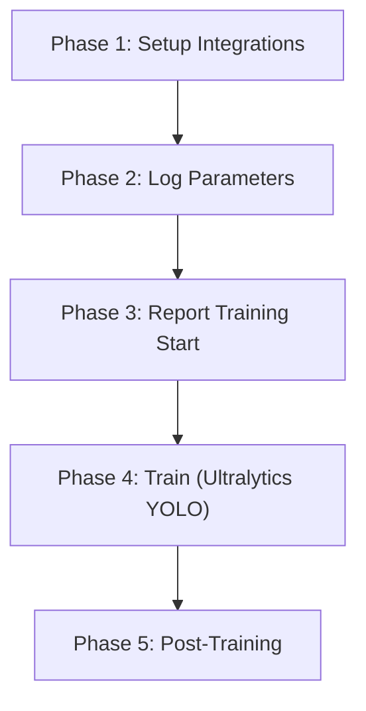

# Training Runner

The `TrainingRunner` class provides declarative, integration-aware training execution. It replaces manual scripting with a composable pipeline that automatically wires MLflow, Nessie, FiftyOne, Features, and Prometheus hooks around YOLO training.

## Constructor

```python
class TrainingRunner:
    def __init__(
        self,
        config: TrainingConfig,
        platform: PlatformConfig | None = None,
        experiment_name: str | None = None,
    ):
```

| Parameter | Type | Default | Description |
|-----------|------|---------|-------------|
| `config` | `TrainingConfig` | — | Training hyperparameters and integration settings. |
| `platform` | `PlatformConfig \| None` | `None` | Platform config. Auto-resolved via `PlatformConfig.from_env()` if omitted. |
| `experiment_name` | `str \| None` | `None` | Experiment name. Auto-generated as `{model}_{timestamp}` if omitted. |

```python
from shml.config import TrainingConfig
from shml.training.runner import TrainingRunner

cfg = TrainingConfig.from_yaml("config/profiles/balanced.yaml")
runner = TrainingRunner(cfg, experiment_name="wider-face-v3")
results = runner.run()
```

---

## Lifecycle Phases

The `run()` method executes five sequential phases:



### `run()`

```python
def run(self, dry_run: bool = False) -> dict[str, Any]:
```

Execute the full training pipeline. Returns a results dict.

| Parameter | Type | Default | Description |
|-----------|------|---------|-------------|
| `dry_run` | `bool` | `False` | If `True`, runs setup and logs config but skips actual training. |

**Returns:**

```python
{
    "metrics": {"mAP50": 0.87, "mAP50-95": 0.62, "duration_minutes": 142.5},
    "model_path": "/tmp/ray/runs/detect/train/",
    "run_id": "abc123def456",
    "branch": "experiment/yolo11x_20260228_140000",
    "duration_seconds": 8550.0,
}
```

!!! tip "Dry Run"
    Use `dry_run=True` to validate config and integration connectivity
    without starting GPU-intensive training:

    ```python
    results = runner.run(dry_run=True)
    print(results["health"])   # {'mlflow': True, 'nessie': True, ...}
    print(results["config"])   # Ultralytics-format dict
    ```

---

## Integration Hooks

The runner initializes integrations declared in `config.integrations`. Each integration is optional — failures are logged but don't abort training.

### Phase 1: Setup Integrations

Each enabled integration is initialized lazily:

| Integration | Setup Action |
|-------------|-------------|
| **MLflow** | Creates/resumes experiment, starts a new run → stores `run_id` |
| **Nessie** | Creates an experiment branch (e.g. `experiment/yolo11x_20260228_140000`) |
| **FiftyOne** | Checks availability (requires MongoDB connection) |
| **Features** | Checks feature store availability |
| **Prometheus** | Initializes `PrometheusReporter` with job name and grouping key |

```python
# Control which integrations are wired up via config
cfg = TrainingConfig(
    integrations=["mlflow", "prometheus"],  # Only these two
    mlflow_experiment="my-experiment",
)
runner = TrainingRunner(cfg)
```

### Phase 2: Log Parameters

If MLflow is enabled, the runner logs all training parameters:

```python
# Logged automatically:
{
    "model": "yolo11x.pt",
    "data_yaml": "/tmp/ray/data/wider_face_yolo/data.yaml",
    "epochs": 10,
    "batch_size": 4,
    "imgsz": 1280,
    "optimizer": "AdamW",
    "lr0": 0.0001,
    "lrf": 0.01,
    "weight_decay": 0.0005,
    "experiment": "yolo11x_20260228_140000",
    "nessie_branch": "experiment/yolo11x_20260228_140000",  # if Nessie enabled
}
```

### Phase 3: Report Training Start

If Prometheus is enabled, reports training start metrics:

- Experiment name
- Total epochs
- Batch size
- Model name

### Phase 4: Train

Runs `YOLO.train()` with the Ultralytics-format config dict from `config.to_ultralytics_dict()`.

### Phase 5: Post-Training

| Integration | Post-Training Action |
|-------------|---------------------|
| **MLflow** | Log final metrics, log model artifact, register best model, end run |
| **Nessie** | Tag the experiment branch with final metrics |
| **Features** | Log final model metrics with epoch count |
| **Prometheus** | Report training completion with final metrics |

---

## MLflow URI Conflict Handling

Ultralytics has its own MLflow integration that can conflict with the runner's MLflow client. The runner handles this automatically:

1. **Before training:** Calls `mlflow.suppress_for_ultralytics()` to prevent Ultralytics from creating a competing MLflow run
2. **After training:** Calls `mlflow.restore_after_ultralytics()` to restore the original MLflow state

This is wrapped in a `try/finally` block so the restore always executes, even if training fails.

```python
# Internal flow (handled automatically):
if self._mlflow:
    self._mlflow.suppress_for_ultralytics()
try:
    results = model.train(**train_args)
finally:
    if self._mlflow:
        self._mlflow.restore_after_ultralytics()
```

!!! warning "Don't set `MLFLOW_TRACKING_URI` manually"
    The runner manages the MLflow tracking URI through `PlatformConfig`.
    Setting the env var directly may cause Ultralytics to create duplicate runs.

---

## Error Handling and Cleanup

### Training Errors

If Ultralytics is not installed, the runner raises `SHMLError`:

```python
try:
    runner.run()
except SHMLError as e:
    print(f"Training failed: {e}")
```

### Integration Failures

Integration failures are **non-fatal**. Each integration is wrapped in a try/except:

- Setup failures are logged and the integration is skipped
- Post-training failures are logged but don't affect the training result
- The `health` dict returned from `_setup_integrations()` reports which integrations succeeded

```python
# Example output with a failed integration:
#   [MLflow] Experiment: balanced-training, run: abc123
#   [Nessie] FAILED: Connection refused
#   [Prometheus] Available
```

### Cleanup

The runner cleans up in Phase 5:

- MLflow runs are always ended (via `end_run()`)
- Prometheus reports training completion regardless of success/failure
- Model artifacts are logged before the run is closed

!!! note "GPU Yield/Reclaim"
    GPU lifecycle management (`gpu_yield` / `gpu_reclaim`) is handled by
    the `Client`, not the `TrainingRunner`. When submitting jobs via
    `Client.submit_training()`, the platform handles GPU scheduling
    automatically.

---

## Full Example

```python
from shml.config import TrainingConfig, PlatformConfig
from shml.training.runner import TrainingRunner

# Load profile with overrides
cfg = TrainingConfig.from_yaml(
    "config/profiles/balanced.yaml",
    epochs=20,
    batch=2,
    mlflow_experiment="wider-face-v3",
)

# Optional: explicit platform config
platform = PlatformConfig.from_env()

# Create and run
runner = TrainingRunner(cfg, platform=platform, experiment_name="wider-face-v3")
results = runner.run()

# Inspect results
print(f"mAP@50:    {results['metrics'].get('mAP50', 'N/A')}")
print(f"mAP@50-95: {results['metrics'].get('mAP50-95', 'N/A')}")
print(f"Duration:  {results['duration_seconds'] / 60:.1f} min")
print(f"MLflow:    {results['run_id']}")
print(f"Nessie:    {results['branch']}")
```
